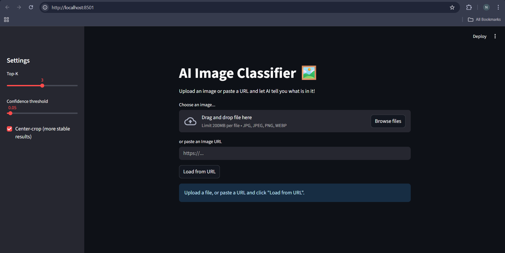

# AI-Image-Classifier-Agent

A lightweight image classifier built with **Streamlit** and **Keras MobileNetV2** (pretrained on ImageNet).  
It keeps the UI and code simple while adding practical touches: URL input, EXIF orientation fix, optional center-crop, Top-K and a confidence threshold, plus inference time.



---

## Features

- **URL or file input** — paste an image URL or upload from disk.
- **EXIF orientation fix** — images display with the correct rotation.
- **Optional center-crop** — improves robustness on odd aspect ratios.
- **Top-K & confidence threshold** — control how many results and how confident they must be.
- **Fast startup** — cached model loading and memoized URL fetches.
- **Inference time** — see how long prediction takes on your machine.

---

## Quick start (with `uv`)

> Recommended if you’re using Astral’s **uv** (fast Python package manager).

   ```bash
   # install dependencies from pyproject.toml
   uv sync

   # run the app
   uv run streamlit run app.py
   ```

Apple Silicon (macOS): if TensorFlow gives you trouble:
   ```bash
   uv remove tensorflow
   uv add tensorflow-macos
   uv sync
   ```

---

## Alternative setup (pip + venv)

   ```bash
   python -m venv .venv
   # macOS/Linux
   source .venv/bin/activate
   # Windows
   # .venv\Scripts\activate

   # install deps (choose one)
   pip install -r requirements.txt
   # or:
   # pip install streamlit tensorflow pillow numpy requests

   streamlit run app.py
   ```

---

## Usage

1. Upload an image or paste an Image URL and click Load from URL.
2. Adjust Top-K, Confidence threshold, and Center-crop in the sidebar.
3. Click Classify to see predictions and the Inference time.

**What do the settings mean?**
- Top-K: show up to K best classes (by score).
- Confidence threshold: minimum model score (0–1) for a class to be shown.
    - Higher threshold → fewer, more confident results.
    - Lower threshold → more (possibly noisy) results.
- Center-crop: crops the image to a centered square before resizing, which often improves recognition on extreme aspect ratios.

---

## Project structure

   ```text
   .
   ├── app.py
   ├── uv.lock               # if using uv
   ├── pyproject.toml        # if using uv
   ├── README.md
   └── .gitignore
   └── .python-version
   ```

---

## How it works (short)

- Loads MobileNetV2 (ImageNet) and caches it for reuse.
- Opens images as RGB with EXIF orientation applied.
- Optional center-crop, then resize to 224×224 and apply the model’s preprocess_input.
- Decodes predictions to human-readable ImageNet labels; filters by Top-K and threshold.
- Uses Streamlit session_state to persist the loaded image between reruns (so “Load from URL” and “Classify” are separate, stable steps).

---

## Notes & tips

- First run may download model weights; subsequent runs are fast.
- Some servers don’t send `Content-Type: image/*`; the loader still tries to open the bytes.
- If you see “No classes above the selected threshold”, try lowering the threshold (e.g., 0.0–0.1).
- MobileNetV2 is optimized for speed. For higher accuracy later, consider larger ImageNet models (with increased resource cost).

---

## License

This project is licensed under the MIT License.
